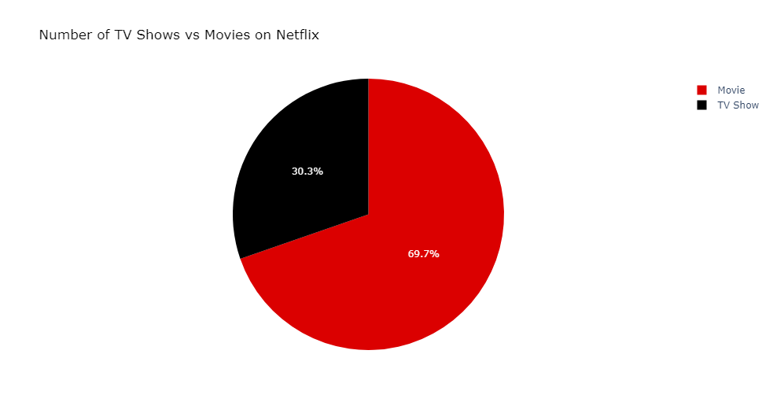
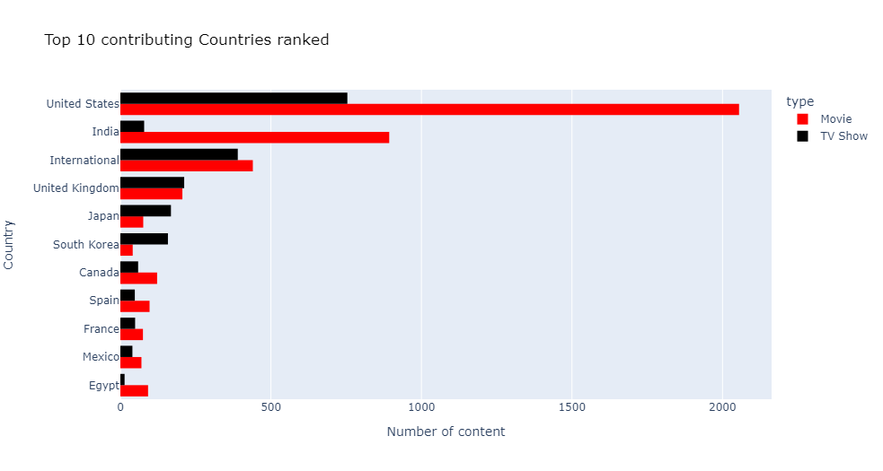
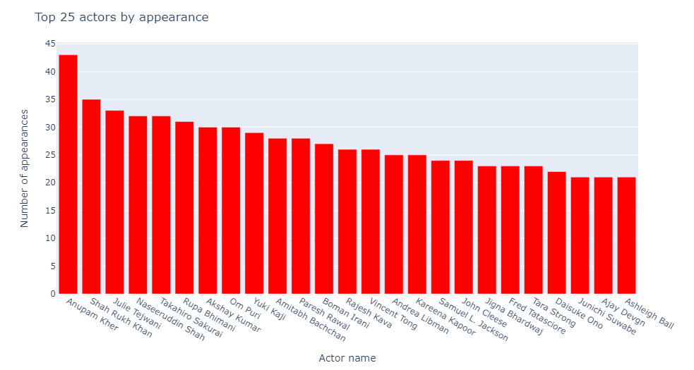
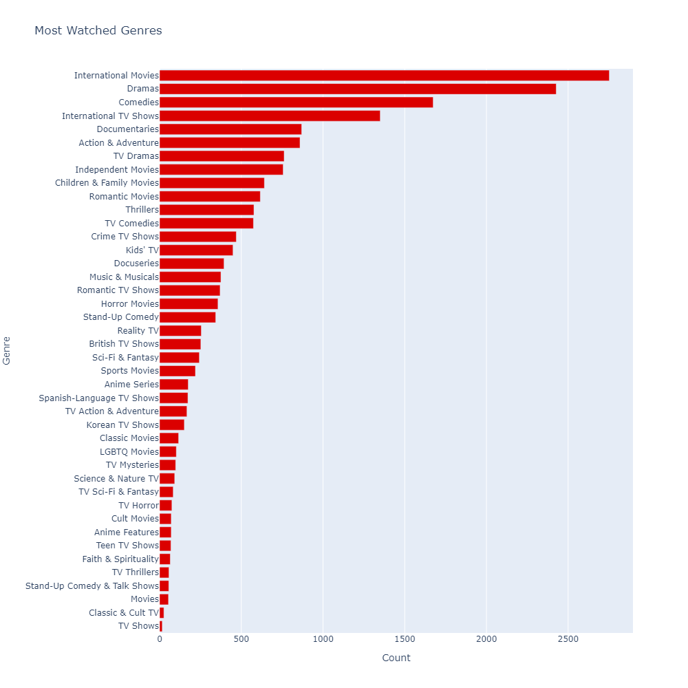
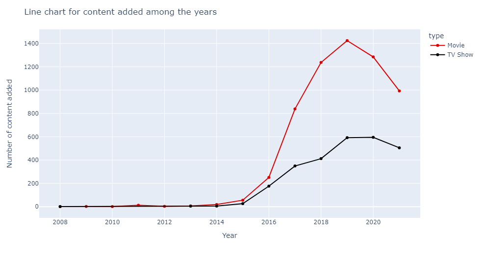
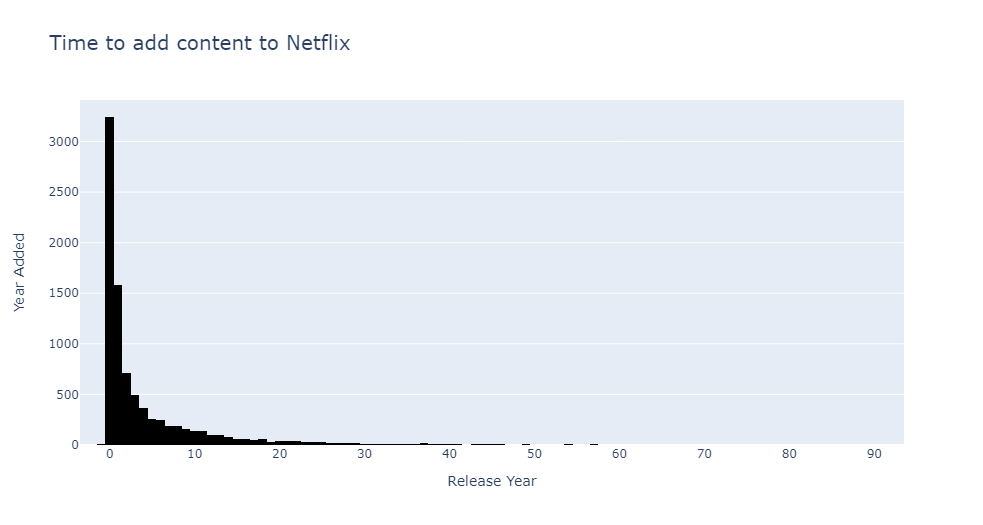
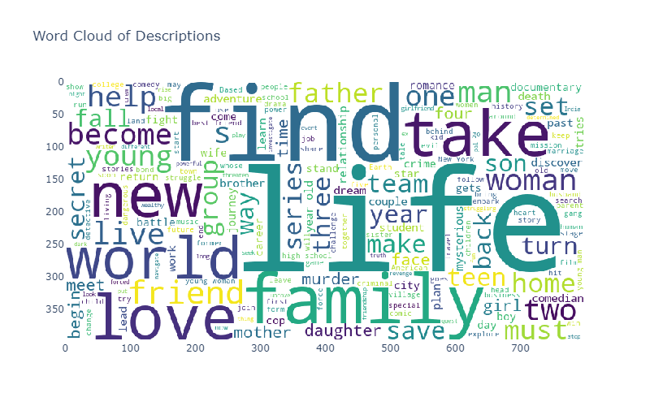
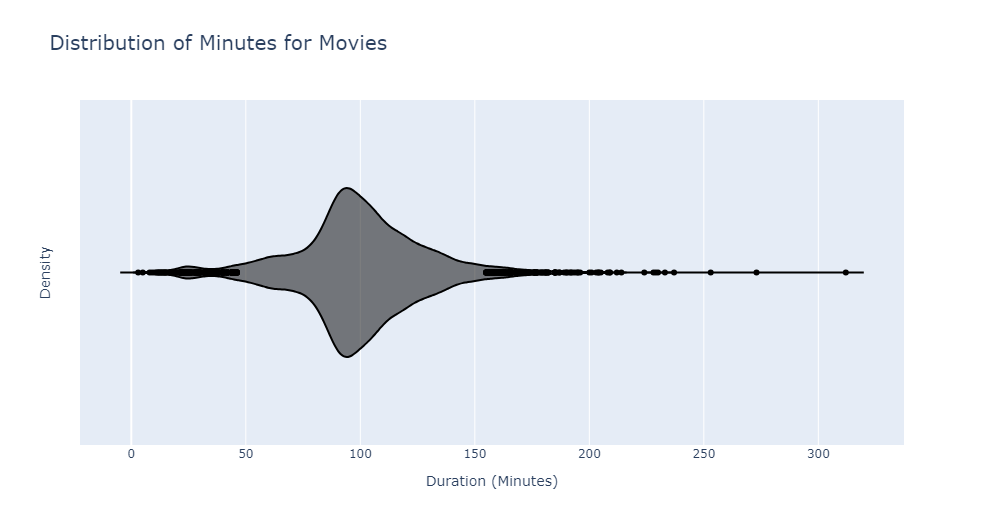
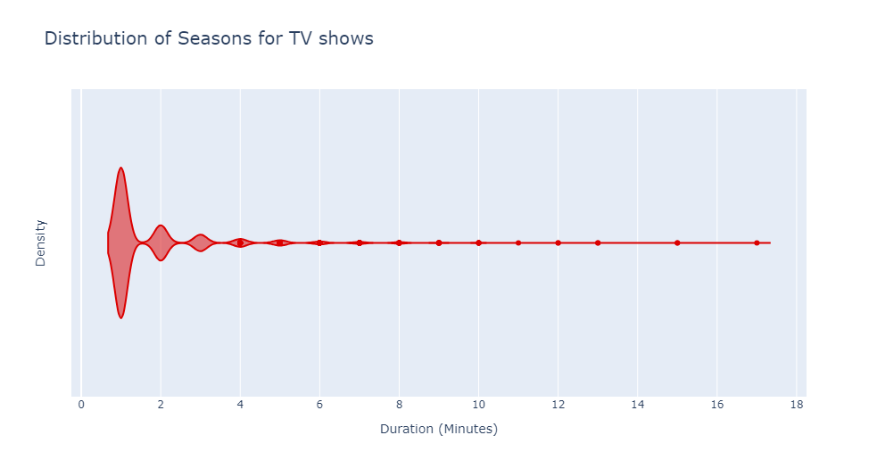
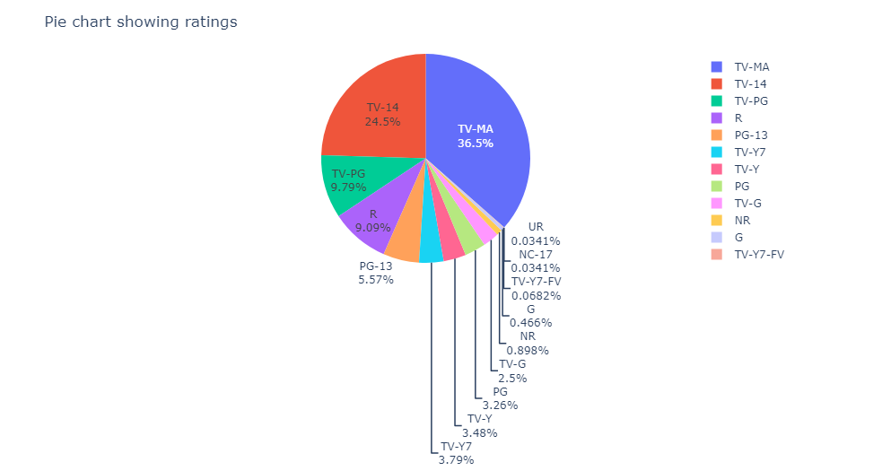

# Netflix Exploratory Data Analysis (EDA)

This project conducts a comprehensive exploratory data analysis of Netflix content, including movies, TV shows, actors, genres, and other key attributes. The goal is to uncover patterns, trends, and insights within Netflix's extensive catalog.

## Table of Contents

- [Introduction](#introduction)
- [Data Source](#data-source)
- [Methodology](#methodology)
- [Insights](#insights)
- [Conclusion](#conclusion)

## Introduction

The purpose of this project is to perform a detailed analysis of Netflix's movies and TV shows, examining various attributes such as genres, actors, countries of origin, release years, and more. This analysis aims to provide valuable insights into the content available on Netflix and the trends over time.

## Data Source

The data used in this analysis comes from the publicly available Netflix dataset, which includes information on titles, types, descriptions, release years, ratings, durations, and other relevant attributes.

## Methodology

1. **Data Cleaning**: 
   - Removed unnecessary columns and handled missing values.
   - Fixed data types (e.g., converted date columns to datetime format, split duration into separate columns for seasons and minutes).
   - Generated a new feature indicating the time until content was added to Netflix (calculated as the difference between the release year and the year added to Netflix).
   
2. **Exploratory Data Analysis (EDA)**:
   - Visualized the distribution of various attributes using histograms, bar charts, line charts, and pie charts.
   - Created word clouds to highlight the most frequent words in content descriptions.

## Insights

The insights folder contains various visualizations generated during the analysis. Here are the key findings:

1. **Ratio Between Movies and TV Shows**:
   
   - This pie chart shows the ratio of movies to TV shows available on Netflix.

2. **Top 20 Contributing Countries**:
   
   - A bar chart displaying the top 20 countries contributing content to Netflix.

3. **Top 25 Actors to Appear**:
   
   - A bar chart listing the 25 actors who appear most frequently in Netflix content.

4. **Most Watched Genres**:
   
   - A bar chart showing the most watched genres on Netflix.

5. **Content Added Over the Years**:
   
   - A line chart illustrating the number of titles added to Netflix each year.

6. **Time to Add Content to the Platform**:
   
   - A histogram showing the distribution of the time taken for Netflix to add content after its release.

7. **Most Frequent Words in Content Descriptions**:
   
   - A word cloud highlighting the most frequent words used in content descriptions, providing insights into common themes and topics.

8. **Distribution for Number of Minutes for Movies**:
   
   - A violin plot showing the distribution of movie durations in minutes.

9. **Distribution for Number of Seasons for TV Shows**:
   
   - A violin plot displaying the distribution of the number of seasons for TV shows.

10. **Pie Chart for Movie/Shows Ratings**:
    
    - A pie chart illustrating the distribution of content ratings (e.g., PG-13, R, etc.).

## Conclusion

This exploratory data analysis provides a comprehensive overview of Netflix's content, revealing key trends and patterns. The insights gained can be valuable for understanding the platform's content strategy and viewer preferences.
